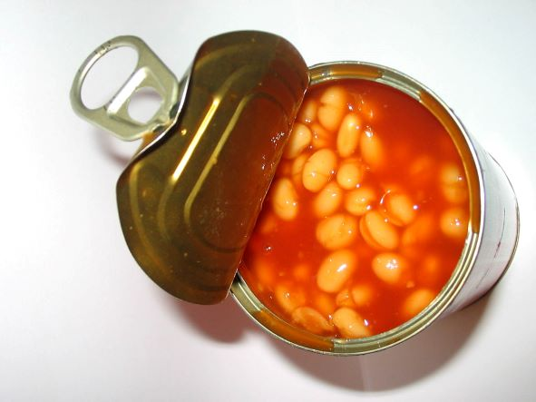

<link href="style.css" rel="stylesheet"></link> 

# Network Models

## Table of Contents 

  - [OSI Model](#osi-model)
    - [OSI Model Acronyms](#osi-model-acronyms)
      - [Layer 7 to 1 Acronym](#layer-7-to-1-acronym)
      - [Layer 1 to 7 Acronym](#layer-1-to-7-acronym)
  - [TCP/IP Model](#tcpip-model)
      - [Layer 1 to 4 Acronym](#layer-1-to-4-acronym)
  - [Protocol Data Units (PDUs)](#protocol-data-units-pdus)
  - [Transport Layer (layer 4) Protocols](#transport-layer-layer-4-protocols)
  - [IP Header Protocol Identifiers](#ip-header-protocol-identifiers)
 

 

## OSI Model
| Number| Layer Name | Protocol | Explanation
|------|-------| -------| -------|
| 7.| Application | FTP   HTTP   SMTP |  File Transfer Protocol   Hyper Text Transfer Protocol   Simple Mail Transfer Protocol| 
| 6.| Presentation | JPEG   MPEG| syntax layer (applications can understand the network formats) | 
| 5.| Session | NetBIOS   PPTP | establishes, manages and terminates connections between local and remote systems | 
| 4.| Transport | TCP   UDP | TCP - reliable delivery   UDP - unreliable delivery | 
| 3.| Network | IP   ICMP   | Internet Protocol   Internet Control Message Protocol  | 
| 2.| Data Link | ARP (Address Resolution Protoocol)   PPP   ATM | used to resolve layer 3 network to layer 2 addresses | 
| 1.| Physical | Ethernet   USB  | transport data using electrical, mechanical or procedural interfaces | 

 

- [Back to Table of Contents](#table-of-contents)

 
  
## OSI Model Acronyms
### Layer 7 to 1 Acronym
 
<figure>
    
    <figcaption>

**A**ll **P**eople **S**eem **T**o **N**eed **D**ata **P**rocessing
    </figcaption>
</figure>

 

| Number| Layer Name | Acronym
|------|-------|-------|
| 7.| Application | All ⬇️| 
| 6.| Presentation | People |
| 5.| Session | Seem | 
| 4.| Transport | To |
| 3.| Network | Need |
| 2.| Data Link | Data |
| 1.| Physical | Processing |

 

- [Back to Table of Contents](#table-of-contents)
 
 

### Layer 1 to 7 Acronym
 

<figure>
    
    <figcaption>

**P**lease **D**o **N**ot **T**hrow **S**ausage **P**izza **A**way
    </figcaption>
</figure>

 

| Number| Layer Name | Acronym
|------|-------|-------|
| 7.| Application | Away | 
| 6.| Presentation | Pizza  |
| 5.| Session | Sausage | 
| 4.| Transport | Throw |
| 3.| Network | Not |
| 2.| Data Link | Do |
| 1.| Physical | Please ⬆️|

 

- [Back to Table of Contents](#table-of-contents)

 

## TCP/IP Model
| Number| Layer Name | 
|------|-------|
| 4.| Application | 
| 3.| Transport | 
| 2.| Internet |
| 1.| Network Interface |

 

- [Back to Table of Contents](#table-of-contents)

 

### Layer 1 to 4 Acronym
 

| Number| Layer Name | Acronym
|------|-------|-------|
| 4.| Application | A ⬇️| 
| 3.| Transport | t |
| 2.| Internet | i | 
| 1.| Network Interface | n |

<figure>
    
    <figcaption>

**A** &nbsp;  **t** **i** **n** of beans
    </figcaption>
</figure>

 

- [Back to Table of Contents](#table-of-contents)

 

## Protocol Data Units (PDUs)
| Number| PDU Name | 
|------|-------|
| 4.| Segments | 
| 3.| Packets | 
| 2.| Frames |
| 1.| Bits |

 
<figure>
    
    <figcaption>

**S**ome **P**eople **F**ear **B**irthdays
    </figcaption>
</figure>

 

- [Back to Table of Contents](#table-of-contents)

 

## Transport Layer (layer 4) Protocols
| TCP| v. | UDP
|------|-------|-------|
| - connection-oriented|  | - connectionless | 
| - more overhead than UDP|  | - very little overhead |
| - flow control   - sequencing   - acknowledgements |  | - used for voice and video traffic | 
| - reliable delivery|  | - delivery is not guaranteed |
| - can multiplex using ports|  |  |
| - error recovery|  |  |

 

>  ⚠️ In voice and video communications efficiency and non-delay is key at the sacrifice of reliability! 

 

- [Back to Table of Contents](#table-of-contents)

 

## IP Header Protocol Identifiers
| Protocol number| Protocol | 
|------|-------|
| 1| ICMP | 
| 6| TCP | 
| 17| UDP |
| 88| EIGRP |
| 89| OSPF |

 

- [Back to Table of Contents](#table-of-contents)

> Test 
{bluecard}